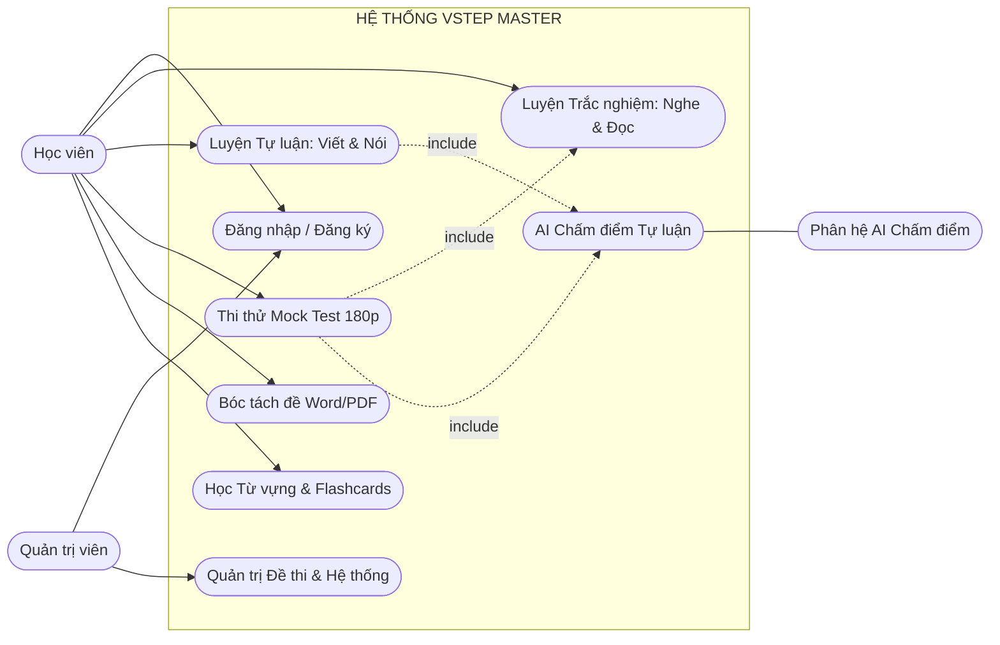
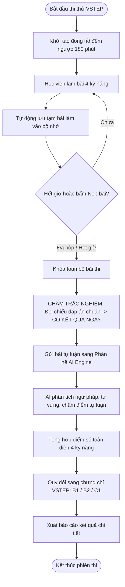
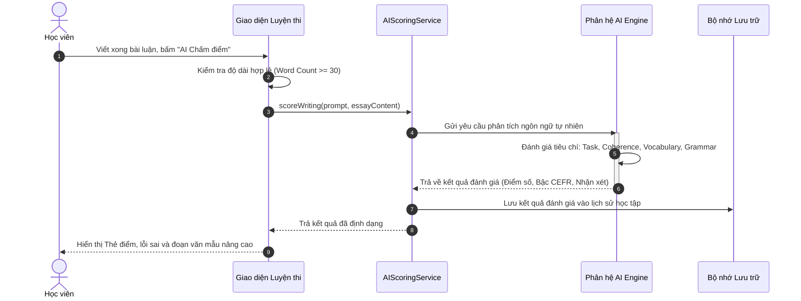
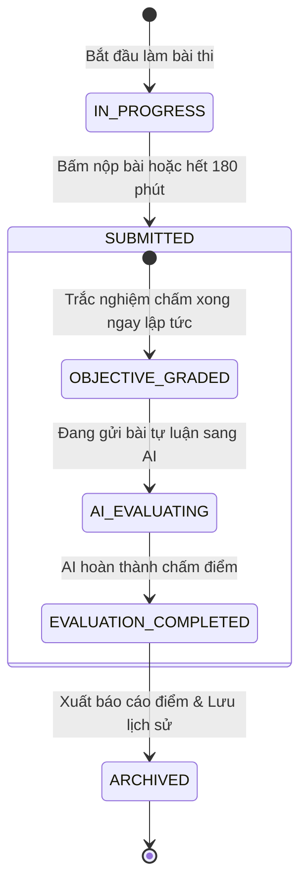
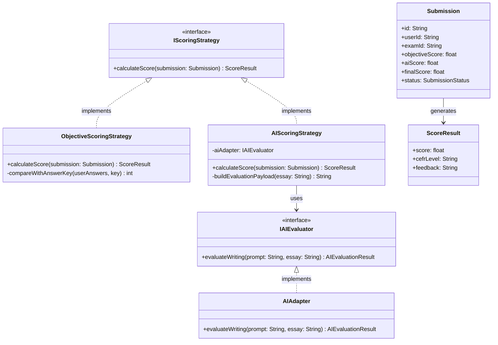
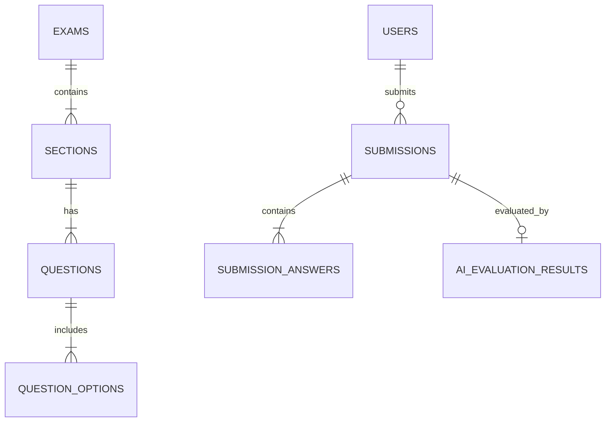

# BÁO CÁO BÀI TẬP LỚN MÔN THIẾT KẾ PHẦN MỀM NÂNG CAO

**ĐỀ TÀI:**
# PHÂN TÍCH VÀ THIẾT KẾ HỆ THỐNG LUYỆN THI VSTEP 4 KỸ NĂNG TÍCH HỢP TRÍ TUỆ NHÂN TẠO CHẤM ĐIỂM TỰ ĐỘNG (VSTEP MASTER)

---

* **Học phần:** Thiết kế phần mềm nâng cao
* **Học kỳ / Năm học:** Học kỳ 1 - Năm học 2026 - 2027
* **Nền tảng công nghệ thực nghiệm:** React 18, TypeScript, Tailwind CSS, Trí tuệ nhân tạo (AI Engine)

---

## PHÂN CÔNG CÔNG VIỆC TRONG NHÓM

| STT | Họ và tên | Mã sinh viên | Công việc được phân công | Mức độ hoàn thành | Ký tên |
|:---:|:---|:---:|:---|:---:|:---:|
| 1 | [Họ tên SV 1] | [Mã SV 1] | Khảo sát yêu cầu, Kiến trúc Clean Architecture, Thiết kế CSDL 3NF | 100% | |
| 2 | [Họ tên SV 2] | [Mã SV 2] | Phân tích mô hình UML (Use Case, Sequence), Thiết kế GoF Design Patterns | 100% | |
| 3 | [Họ tên SV 3] | [Mã SV 3] | Cài đặt mã nguồn Frontend, Tích hợp Module AI Chấm điểm tự động | 100% | |
| 4 | [Họ tên SV 4] | [Mã SV 4] | Xây dựng bộ Test Cases, Kiểm thử hệ thống, Tổng hợp tài liệu báo cáo | 100% | |

---

## DANH MỤC THUẬT NGỮ VÀ CÁC TỪ VIẾT TẮT

| Viết tắt | Thuật ngữ Tiếng Anh | Định nghĩa & Ý nghĩa trong hệ thống |
|:---|:---|:---|
| **VSTEP** | Vietnamese Standardized Test of English Proficiency | Kỳ thi đánh giá năng lực tiếng Anh theo Khung năng lực ngoại ngữ 6 bậc dùng cho Việt Nam (Bậc 3: B1, Bậc 4: B2, Bậc 5: C1). |
| **CEFR** | Common European Framework of Reference for Languages | Khung tham chiếu trình độ ngôn ngữ chung của Châu Âu. |
| **SRS** | Software Requirements Specification | Tài liệu đặc tả yêu cầu phần mềm. |
| **SDD** | Software Design Document | Tài liệu thiết kế kỹ thuật phần mềm. |
| **UML** | Unified Modeling Language | Ngôn ngữ mô hình hóa thống nhất dùng để trực quan hóa kiến trúc và luồng xử lý phần mềm. |
| **GoF** | Gang of Four | Nhóm 4 tác giả khởi xướng 23 mẫu thiết kế hướng đối tượng kinh điển. |
| **AI** | Artificial Intelligence | Trí tuệ nhân tạo ứng dụng phân tích và đánh giá ngôn ngữ tự nhiên. |
| **3NF** | Third Normal Form | Dạng chuẩn 3 trong thiết kế cơ sở dữ liệu quan hệ, loại bỏ hoàn toàn các phụ thuộc bắc cầu. |
| **ERD** | Entity Relationship Diagram | Sơ đồ biểu diễn thực thể và mối quan hệ trong cơ sở dữ liệu. |
| **SPA** | Single Page Application | Ứng dụng web một trang, tương tác mượt mà không cần tải lại toàn bộ trang web. |
| **RBAC** | Role-Based Access Control | Cơ chế kiểm soát truy cập dựa trên vai trò người dùng (Học viên vs Quản trị viên). |

---

## MỤC LỤC TỔNG QUAN

* **CHƯƠNG 1: GIỚI THIỆU VÀ ĐẶC TẢ BÀI TOÁN**
  * 1.1. Lý do chọn đề tài và mục tiêu hệ thống
  * 1.2. Mô tả bài toán nghiệp vụ luyện thi VSTEP thực tế
  * 1.3. Phân tích các quy trình nghiệp vụ cốt lõi
  * 1.4. Bảng mã hóa yêu cầu chức năng (Functional Requirements - `[YC-xxx]`)
  * 1.5. Bảng yêu cầu phi chức năng (Non-Functional Requirements - FURPS+)
  * 1.6. Tiêu chuẩn nghiệm thu phần mềm (Acceptance Criteria)
* **CHƯƠNG 2: PHÂN TÍCH HỆ THỐNG VỚI UML (UML ANALYSIS)**
  * 2.1. Biểu đồ ca sử dụng tổng quan (Use Case Diagram)
  * 2.2. Phân rã ca sử dụng & Đặc tả kịch bản chi tiết (Use Case Specifications)
  * 2.3. Biểu đồ hoạt động (Activity Diagrams)
  * 2.4. Biểu đồ tuần tự (Sequence Diagrams)
  * 2.5. Biểu đồ máy trạng thái (State Machine Diagram) vòng đời bài thi
* **CHƯƠNG 3: THIẾT KẾ HỆ THỐNG NÂNG CAO (ADVANCED ARCHITECTURE & DESIGN)**
  * 3.1. Thiết kế kiến trúc phần mềm (Clean / Layered Architecture)
  * 3.2. Ứng dụng các Mẫu thiết kế phần mềm (GoF Design Patterns) & Biểu đồ lớp (Class Diagram)
  * 3.3. Thiết kế Cơ sở dữ liệu 3 mức (Khái niệm - Logic 3NF - Vật lý)
  * 3.4. Thiết kế giao diện và luồng người dùng (UI/UX Design)
* **CHƯƠNG 4: CÀI ĐẶT THỰC NGHIỆM, KIỂM THỬ VÀ KẾT LUẬN**
  * 4.1. Môi trường công nghệ và hiện thực hóa mã nguồn (`vstep-app`)
  * 4.2. Kế hoạch và kết quả kiểm thử (Test Cases & Test Matrix)
  * 4.3. Kết luận và định hướng phát triển

---

# CHƯƠNG 1. GIỚI THIỆU VÀ ĐẶC TẢ BÀI TOÁN

## 1.1. Lý do chọn đề tài và mục tiêu hệ thống
Kỳ thi **VSTEP (B1, B2, C1)** là chuẩn đầu ra quan trọng đối với sinh viên và người đi làm tại Việt Nam. Quá trình ôn luyện VSTEP bao gồm cả 4 kỹ năng: Nghe, Đọc, Viết và Nói. Trong đó:
1. **Các phần thi Trắc nghiệm (Nghe, Đọc):** Có đáp án cố định, thí sinh có thể tự làm và hệ thống tự động đối chiếu chấm điểm ngay.
2. **Các phần thi Tự luận (Viết, Nói):** Đòi hỏi đánh giá ngữ nghĩa, cấu trúc ngữ pháp và độ mạch lạc. Thí sinh tự học thường thiếu người hướng dẫn sửa lỗi và chấm điểm.

**Mục tiêu của hệ thống VSTEP Master:**
* Xây dựng một nền tảng Web Application tự học và luyện thi VSTEP toàn diện 4 kỹ năng.
* **Tự động hóa hoàn toàn việc chấm điểm:**
  - Phần trắc nghiệm: Chấm điểm tự động theo bộ đáp án chuẩn ngay khi nộp bài.
  - Phần tự luận (Viết/Nói): Tích hợp **Module Trí tuệ nhân tạo (AI Engine)** tự động phân tích bài viết, đánh giá theo khung năng lực CEFR, chấm điểm thang 10 và chỉ ra các lỗi ngữ pháp kèm gợi ý bài mẫu nâng cao.
* Hỗ trợ công cụ **Custom Test** bóc tách tự động tệp đề thi Word (`.docx`) và PDF (`.pdf`) thành đề trắc nghiệm trực tuyến để học viên tự làm đề riêng.
* Hệ thống xác thực tài khoản thông thường (Username/Password), phân quyền rõ ràng giữa **Học viên** và **Quản trị viên**.

---

## 1.2. Mô tả bài toán nghiệp vụ
Hệ thống phục vụ 2 nhóm tác nhân (Actors) chính cùng 1 hệ thống trí tuệ nhân tạo:
1. **Học viên (Student/User):**
   - Đăng nhập/Đăng ký tài khoản hệ thống (Username/Password).
   - Luyện tập từng kỹ năng chuyên biệt: Nghe (Audio), Đọc (Văn bản dài + tra từ), Viết (Soạn thảo bài luận + AI chấm điểm), Nói (Ghi âm + Luyện theo chủ đề).
   - Tham gia thi thử toàn diện (Mock Test 180 phút đếm ngược có tự động khóa bài khi hết giờ).
   - Tải file Word/PDF lên để tự tạo đề thi và luyện tập trực tiếp.
   - Học từ vựng CEFR qua thẻ Flashcard và thư viện đọc dịch song ngữ.
2. **Quản trị viên (Administrator):**
   - Quản lý ngân hàng đề thi chuẩn, danh mục bài giảng và dữ liệu từ vựng.
   - Giám sát hoạt động học tập và nhật ký hệ thống.
3. **Phân hệ Trí tuệ nhân tạo (AI Engine - External Service):**
   - Đóng vai trò giám khảo ảo, tự động tiếp nhận bài làm tự luận, phân tích ngôn ngữ tự nhiên và trả về kết quả đánh giá đa tiêu chí.

---

## 1.3. Phân tích quy trình nghiệp vụ cốt lõi

### Quy trình 1: Luyện tập Tự luận & AI Chấm điểm Tự động
1. Học viên chọn đề bài Viết (Task 1 / Task 2) hoặc chủ đề Nói (Part 1, 2, 3) và tiến hành làm bài trên hệ thống.
2. Học viên nhấn nút **"AI Chấm điểm"**.
3. Hệ thống kiểm tra tính hợp lệ của bài làm (độ dài tối thiểu, cấu trúc câu).
4. Hệ thống đóng gói nội dung bài làm kèm khung tiêu chí đánh giá VSTEP và gửi tới **Phân hệ AI Engine**.
5. AI Engine phân tích ngữ pháp, từ vựng, tính liên kết và trả về:
   - Điểm tổng quan trên thang điểm 10.
   - Bậc năng lực ước lượng theo khung CEFR (B1, B2, hoặc C1).
   - Danh sách nhận xét chi tiết và các đoạn văn đề xuất chỉnh sửa nâng cao.
6. Hệ thống hiển thị kết quả trực quan trên giao diện và tự động lưu vào lịch sử học tập của học viên.

### Quy trình 2: Thi thử VSTEP toàn diện (Mock Test 180 phút)
1. Thí sinh chọn đề thi thử tổng hợp và nhấn **"Bắt đầu làm bài"**. Hệ thống kích hoạt đồng hồ đếm ngược 180 phút.
2. Thí sinh lần lượt làm các phần thi. Hệ thống tự động lưu tạm tiến độ làm bài để phòng ngừa sự cố gián đoạn.
3. Khi hết giờ (Timer chạm mốc 00:00:00) hoặc khi thí sinh bấm **"Nộp bài"**:
   - Hệ thống tự động cưỡng chế khóa toàn bộ bài thi.
   - **Phần trắc nghiệm (Nghe, Đọc):** Đối chiếu đáp án chuẩn $\rightarrow$ Có kết quả và giải thích ngay.
   - **Phần tự luận (Viết, Nói):** Kích hoạt Module AI phân tích và trả về điểm số tự luận.
   - Hệ thống tổng hợp điểm số 4 kỹ năng, tính điểm trung bình và xuất báo cáo xếp loại chứng chỉ.

### Quy trình 3: Nhập đề thi tùy biến từ Word/PDF (Custom Test)
1. Học viên tải tệp đề thi (`.docx` hoặc `.pdf`) từ máy tính lên hệ thống.
2. Module bóc tách tài liệu tự động đọc cấu trúc văn bản, nhận diện các câu hỏi trắc nghiệm A, B, C, D.
3. Hệ thống chuẩn hóa thành đề thi trực tuyến, cho phép học viên xem trước và bấm bắt đầu làm bài ngay trên trình duyệt.

---

## 1.4. Bảng mã hóa Yêu cầu Chức năng (Functional Requirements)

| Phân hệ | Mã yêu cầu | Tên chức năng | Mô tả chi tiết chức năng | Độ ưu tiên |
|:---|:---|:---|:---|:---:|
| **Xác thực (AUTH)** | `[YC-AUTH-01]` | Đăng nhập tài khoản | Cho phép người dùng đăng nhập bằng Username & Mật khẩu. | Cao |
| | `[YC-AUTH-02]` | Đăng ký học viên | Cho phép người dùng mới tạo tài khoản học tập trên hệ thống. | Cao |
| | `[YC-AUTH-03]` | Phân quyền vai trò | Phân chia quyền hạn giữa Học viên (`user`) và Quản trị viên (`admin`). | Cao |
| | `[YC-AUTH-04]` | Đăng xuất an toàn | Kết thúc phiên làm việc và bảo mật thông tin người dùng. | Cao |
| **Luyện tập (PRAC)** | `[YC-PRAC-01]` | Luyện Listening | Phát audio theo Part, làm bài trắc nghiệm, hiển thị transcript sau khi nộp. | Cao |
| | `[YC-PRAC-02]` | Luyện Reading | Đọc bài văn dài, trả lời 40 câu trắc nghiệm, tra cứu từ vựng trực tiếp. | Cao |
| | `[YC-PRAC-03]` | Luyện Writing | Soạn thảo bài viết Task 1 & 2, tự động đếm số từ. | Cao |
| | `[YC-PRAC-04]` | Luyện Speaking | Cung cấp chủ đề và dàn ý gợi ý, ghi âm giọng nói qua micro. | Cao |
| **AI Đánh giá (AI)** | `[YC-AI-01]` | AI Chấm điểm tự luận | Tự động phân tích bài viết/nói, chấm điểm trên thang 10 và xếp bậc CEFR. | Cao |
| | `[YC-AI-02]` | Nhận xét & Chỉ lỗi sai | Phân tích chi tiết lỗi ngữ pháp, từ vựng và tính mạch lạc của bài làm. | Cao |
| | `[YC-AI-03]` | Gợi ý bài mẫu nâng cao | Đưa ra phiên bản viết lại đạt chuẩn B2/C1 để học viên tham khảo. | Trung bình |
| **Thi thử (MOCK)** | `[YC-MOCK-01]` | Khởi tạo đề Full Test | Mô phỏng trọn vẹn đề thi VSTEP chuẩn 4 kỹ năng. | Cao |
| | `[YC-MOCK-02]` | Đồng hồ đếm ngược 180p | Quản lý thời gian thi thực tế; Tự động thu và khóa bài khi hết giờ. | Cao |
| | `[YC-MOCK-03]` | Tổng hợp & Xếp loại | Tự động chấm trắc nghiệm + AI chấm tự luận $\rightarrow$ Xếp loại B1/B2/C1. | Cao |
| **Tự tạo đề (CUST)** | `[YC-CUST-01]` | Bóc tách đề Word (`.docx`) | Đọc file Word tự động chuyển đổi thành câu hỏi trắc nghiệm trực tuyến. | Cao |
| | `[YC-CUST-02]` | Bóc tách đề PDF (`.pdf`) | Trích xuất văn bản từ tệp PDF để tạo đề thi luyện tập. | Trung bình |
| **Mở rộng (VOCAB)** | `[YC-VOCAB-01]` | Tra cứu từ vựng CEFR | Danh mục từ vựng phân loại theo cấp độ A1-C2 kèm nghĩa và ví dụ. | Trung bình |
| | `[YC-VOCAB-02]` | Thẻ ghi nhớ Flashcard | Học từ vựng lật thẻ hai mặt, đánh dấu từ đã thuộc / cần ôn lại. | Trung bình |

---

## 1.5. Bảng yêu cầu phi chức năng (Non-Functional Requirements - FURPS+)

| Tiêu chí | Mã YC | Mô tả yêu cầu kỹ thuật | Chỉ số đo lường định lượng |
|:---|:---|:---|:---|
| **Tính tiện dụng (Usability)** | `[NFR-USE-01]` | Tương thích đa thiết bị | Giao diện hiển thị tối ưu trên Desktop, Tablet và Mobile. |
| | `[NFR-USE-02]` | Chế độ hiển thị Sáng/Tối | Hỗ trợ chuyển đổi nhanh giữa Dark Mode và Light Mode. |
| **Tính tin cậy (Reliability)** | `[NFR-REL-01]` | Chống mất mát dữ liệu làm bài | Tự động lưu tạm thời đáp án làm bài vào bộ nhớ cục bộ chống mất điện/mất mạng. |
| **Hiệu năng (Performance)** | `[NFR-PER-01]` | Tốc độ chấm trắc nghiệm | Trả kết quả trắc nghiệm tức thì (< 50ms) ngay khi bấm nộp bài. |
| | `[NFR-PER-02]` | Tốc độ phản hồi phân tích AI | Thời gian trả kết quả chấm bài tự luận của AI trung bình từ 2 - 4 giây. |
| **Bảo mật (Security)** | `[NFR-SEC-01]` | Bảo mật phiên đăng nhập | Lưu trữ thông tin định danh người dùng an toàn, mã hóa dữ liệu nhạy cảm. |
| | `[NFR-SEC-02]` | Phân quyền truy cập | Ngăn chặn học viên thông thường truy cập các chức năng quản trị hệ thống. |

---

## 1.6. Tiêu chuẩn nghiệm thu phần mềm (Acceptance Criteria)

1. **Chức năng trắc nghiệm:** Học viên làm bài trắc nghiệm, bấm nộp bài là nhận kết quả điểm số và đáp án đúng/sai ngay lập tức.
2. **Chức năng AI Chấm điểm:** Bài làm tự luận gửi sang Module AI trả về đầy đủ: Điểm tổng, Bậc CEFR ước lượng, Nhận xét chi tiết và Bản sửa lỗi đề xuất.
3. **Mô phỏng phòng thi:** Bộ đếm thời gian 180 phút vận hành chính xác, tự động cưỡng chế khóa bài thi khi đồng hồ về 0.
4. **Bóc tách đề thi:** Tải lên tệp Word/PDF mẫu bóc tách thành công cấu trúc câu hỏi trắc nghiệm.
5. **Kiến trúc phần mềm:** Áp dụng chuẩn chỉ mô hình Clean Architecture, mẫu thiết kế Strategy Pattern và CSDL đạt chuẩn 3NF.

---

# CHƯƠNG 2. PHÂN TÍCH HỆ THỐNG VỚI UML

## 2.1. Biểu đồ Ca sử dụng (Use Case Diagram)

---

## 2.2. Đặc tả Ca sử dụng chi tiết (Use Case Specifications)

### 2.2.1. Đặc tả Ca sử dụng: `AI Chấm điểm bài Viết (Writing AI Evaluation)`
* **Mã ca sử dụng:** `UC-AI-01`
* **Tác nhân chính:** Học viên (Student), Phân hệ AI Engine
* **Mục đích:** Đánh giá chất lượng bài viết tự luận của học viên, trả về điểm số và chỉ dẫn sửa lỗi tự động.
* **Tiền điều kiện:** Học viên đã soạn thảo nội dung bài viết trong giao diện Luyện viết.
* **Hậu điều kiện:** Kết quả phân tích điểm số hiển thị trên màn hình và được lưu vào lịch sử học tập.

#### Luồng sự kiện chính:
| Bước | Hành động của Học viên | Phản ứng của Hệ thống | Dữ liệu trao đổi |
|:---:|:---|:---|:---|
| 1 | Học viên hoàn thành bài viết và nhấn nút **"🤖 AI Chấm điểm"**. | Hệ thống khóa nút bấm, hiển thị biểu tượng đang chấm bài. | Nội dung bài viết. |
| 2 | | Hệ thống kiểm tra số từ (yêu cầu tối thiểu >= 30 từ), xây dựng cấu trúc đánh giá theo chuẩn VSTEP. | Dữ liệu bài làm chuẩn hóa. |
| 3 | | Hệ thống chuyển dữ liệu bài làm sang **Phân hệ AI Engine**. | Payload dữ liệu bài viết. |
| 4 | | Phân hệ AI Engine phân tích cú pháp, từ vựng, tính liên kết và trả về kết quả phân tích. | Kết quả: Điểm số, Bậc CEFR, Nhận xét. |
| 5 | | Hệ thống hiển thị Thẻ điểm tổng kết, bảng lỗi sai và đoạn văn mẫu nâng cao cho học viên xem. | Dữ liệu hiển thị UI. |
| 6 | | Hệ thống tự động lưu kết quả vào lịch sử học tập của học viên. | Bản ghi kết quả đánh giá. |

#### Luồng ngoại lệ:
* **1a. Bài viết quá ngắn (< 30 từ):** Hệ thống thông báo bài viết chưa đủ độ dài tối thiểu để AI đánh giá chính xác, dừng tiến trình và yêu cầu viết tiếp.
* **3a. Gián đoạn kết nối tới AI Engine:** Hệ thống thông báo sự cố kết nối, giữ nguyên nội dung bài viết của học viên để học viên có thể bấm chấm lại.

---

### 2.2.2. Đặc tả Ca sử dụng: `Thi thử VSTEP toàn diện (Mock Test)`
* **Mã ca sử dụng:** `UC-MOCK-01`
* **Tác nhân chính:** Học viên (Student)
* **Tiền điều kiện:** Học viên đã mở giao diện Thi thử.
* **Hậu điều kiện:** Bảng điểm tổng hợp 4 kỹ năng được xuất ra, xếp loại chứng chỉ đạt được.

#### Luồng sự kiện chính:
1. Học viên chọn đề thi và bấm **"Bắt đầu làm bài"**. Hệ thống nạp cấu trúc đề 4 kỹ năng và kích hoạt bộ đếm thời gian 180 phút.
2. Học viên lần lượt làm các phần thi. Hệ thống tự động lưu tạm tiến độ bài làm.
3. Khi hết giờ (Timer = 0) hoặc học viên bấm **"Nộp bài"**:
   - Hệ thống cưỡng chế khóa toàn bộ bài thi.
   - Phần trắc nghiệm được đối chiếu tự động với đáp án chuẩn $\rightarrow$ Có điểm ngay.
   - Phần tự luận được gửi tới Module AI để phân tích điểm số tự động.
   - Hệ thống tổng hợp điểm trung bình và hiển thị bảng điểm xếp loại năng lực VSTEP.

---

## 2.3. Biểu đồ Hoạt động (Activity Diagram)

---

## 2.4. Biểu đồ Tuần tự (Sequence Diagram)

### Biểu đồ Tuần tự: Quy trình Nộp bài và AI Chấm điểm Tự động

---

## 2.5. Biểu đồ Máy trạng thái (State Machine Diagram) của Bài thi

---

# CHƯƠNG 3. THIẾT KẾ HỆ THỐNG NÂNG CAO

## 3.1. Thiết kế Kiến trúc phần mềm (Clean Architecture)

Hệ thống được thiết kế theo nguyên lý **Clean Architecture** phân tầng độc lập:
* **Presentation Layer (Tầng Giao Diện):** Chứa các React Components trực quan (`ListeningPractice`, `ReadingPractice`, `WritingPractice`, `MockTest`).
* **Application Layer (Tầng Ứng Dụng):** Điều phối luồng nghiệp vụ (`ExamService`, `AIScoringService`, `DocumentParserService`).
* **Domain Layer (Tầng Nghiệp Vụ Cốt Lõi):** Chứa thực thể (`Exam`, `Submission`, `ScoreCard`) và Interface chiến lược chấm điểm (`IScoringStrategy`).
* **Infrastructure Layer (Tầng Hạ Tầng):** Chứa Adapter giao tiếp dịch vụ AI bên ngoài và Bộ nhớ lưu trữ dữ liệu.

---

## 3.2. Ứng dụng các Mẫu thiết kế phần mềm (GoF Design Patterns)

### 1. Strategy Pattern (Chiến lược Chấm điểm Tự động - Trọng tâm)
* **Bài toán:** Hệ thống có 2 dạng bài với phương thức chấm hoàn toàn khác biệt: Trắc nghiệm (so sánh đáp án cố định) và Tự luận (phân tích ngữ nghĩa bằng AI).
* **Giải pháp:** Định nghĩa Interface `IScoringStrategy`:
  - `ObjectiveScoringStrategy`: Dành cho trắc nghiệm (so sánh chuỗi đáp án A, B, C, D $\rightarrow$ ra kết quả tức thì).
  - `AIScoringStrategy`: Dành cho tự luận (kết nối Module AI phân tích đa tiêu chí $\rightarrow$ trả về điểm số và nhận xét).

### 2. Adapter Pattern (Bộ tương thích Dịch vụ AI)
* Đóng gói logic giao tiếp với nhà cung cấp AI bên trong lớp `AIAdapter` tuân thủ interface `IAIEvaluator`. Điều này giúp hệ thống dễ dàng thay đổi hoặc nâng cấp mô hình AI trong tương lai mà không làm ảnh hưởng đến mã nguồn giao diện.

### 3. Builder Pattern (Khởi tạo Đề thi VSTEP Phức hợp)
* Lớp `VstepExamBuilder` hỗ trợ lắp ghép các phần thi: Listening 3 parts + Reading 4 passages + Writing 2 tasks thành một đề thi hoàn chỉnh.

---

### Biểu đồ Lớp chi tiết (Class Diagram):

---

## 3.3. Thiết kế Cơ sở dữ liệu 3 mức (Database Design)

### 3.3.1. Thiết kế Khái niệm (ERD)

---

### 3.3.2. Thiết kế Logic (Chuẩn hóa 3NF)

Các bảng quan hệ được chuẩn hóa đạt **Dạng chuẩn 3 (3NF)**:
1. `USERS` (**user_id**, username, password, display_name, role, created_at)
2. `EXAMS` (**exam_id**, title, duration_minutes, exam_type, created_at)
3. `SECTIONS` (**section_id**, exam_id, skill_type, title, passage_content, audio_url)
4. `QUESTIONS` (**question_id**, section_id, question_number, question_content, correct_answer)
5. `QUESTION_OPTIONS` (**option_id**, question_id, option_label, option_text)
6. `SUBMISSIONS` (**submission_id**, user_id, exam_id, start_time, submit_time, objective_score, ai_score, final_score, cefr_band, status)
7. `AI_EVALUATION_RESULTS` (**eval_id**, submission_id, grammar_score, vocab_score, coherence_score, overall_score, cefr_level, feedback_details, suggested_revision, created_at)
8. `VOCAB_CARDS` (**card_id**, user_id, word, phonetic, cefr_level, definition_vi, example_en, is_memorized)

---

### 3.3.3. Thiết kế Vật lý (Data Dictionary)

#### Bảng `SUBMISSIONS` (Bài nộp)
| Tên cột | Kiểu dữ liệu | Ràng buộc | Diễn giải |
|:---|:---|:---|:---|
| `submission_id` | VARCHAR(36) | PRIMARY KEY | Định danh duy nhất bài làm |
| `user_id` | VARCHAR(36) | NOT NULL, FK | Thí sinh nộp bài |
| `exam_id` | VARCHAR(36) | NOT NULL, FK | Bài thi nào |
| `objective_score` | DECIMAL(3,1) | DEFAULT 0.0 | Điểm trắc nghiệm (có ngay khi nộp) |
| `ai_score` | DECIMAL(3,1) | DEFAULT 0.0 | Điểm tự luận do AI chấm |
| `final_score` | DECIMAL(3,1) | DEFAULT 0.0 | Điểm tổng kết toàn diện |
| `cefr_band` | VARCHAR(10) | NULL | Bậc năng lực đạt được (`B1`, `B2`, `C1`) |
| `status` | VARCHAR(20) | NOT NULL | Trạng thái: `'IN_PROGRESS'`, `'COMPLETED'` |

#### Bảng `AI_EVALUATION_RESULTS` (Kết quả Phân tích của AI)
| Tên cột | Kiểu dữ liệu | Ràng buộc | Diễn giải |
|:---|:---|:---|:---|
| `eval_id` | VARCHAR(36) | PRIMARY KEY | Định danh bản ghi phân tích |
| `submission_id` | VARCHAR(36) | FK REFERENCES SUBMISSIONS | Thuộc bài nộp nào |
| `overall_score` | DECIMAL(3,1) | NOT NULL | Điểm số tự luận trên thang 10 |
| `cefr_level` | VARCHAR(10) | NOT NULL | Bậc quy đổi (`B1`, `B2`, `C1`) |
| `feedback_details` | TEXT | NOT NULL | Nhận xét chi tiết và phân tích lỗi sai |
| `suggested_revision` | TEXT | NULL | Đoạn văn viết lại mẫu đạt chuẩn B2/C1 |
| `created_at` | TIMESTAMP | DEFAULT NOW() | Thời điểm chấm điểm |

---

## 3.4. Thiết kế Giao diện thực tế (UI/UX Design)

1. **Màn hình Đăng nhập:** Thiết kế đơn giản, nhập tên đăng nhập và mật khẩu với 2 nút đăng nhập nhanh 1 chạm cho Học viên và Quản trị viên.
2. **Màn hình Trắc nghiệm (Nghe/Đọc):** Làm bài và bấm nộp bài $\rightarrow$ Hiển thị ngay bảng thống kê câu đúng/sai cùng transcript và giải thích chi tiết.
3. **Màn hình Tự luận (Viết/Nói):** Khung soạn thảo có bộ đếm từ tự động $\rightarrow$ Bấm nút "AI Chấm điểm" $\rightarrow$ Hiển thị Thẻ điểm, các tiêu chí đánh giá và bài mẫu nâng cao sau 2-3 giây.
4. **Màn hình Tự tạo đề (Custom Test):** Khu vực kéo thả tệp Word/PDF để tự động tạo đề thi riêng.

---

# CHƯƠNG 4. CÀI ĐẶT THỰC NGHIỆM, KIỂM THỬ VÀ KẾT LUẬN

## 4.1. Môi trường công nghệ thực nghiệm (`vstep-app`)
* **Nền tảng giao diện:** React 18, TypeScript, Tailwind CSS.
* **Xác thực tài khoản:** Đăng nhập thông thường bằng Username & Mật khẩu, lưu phiên làm việc an toàn trên trình duyệt.
* **Trí tuệ nhân tạo:** Tích hợp Phân hệ AI Engine phân tích ngôn ngữ tự nhiên.
* **Bóc tách tệp tin:** Thư viện xử lý văn bản Word (`.docx`) và PDF (`.pdf`).

---

## 4.2. Kế hoạch và Kết quả kiểm thử (Test Matrix)

| Mã Test Case | Hạng mục kiểm thử | Các bước thực hiện | Kết quả kỳ vọng | Trạng thái |
|:---:|:---|:---|:---|:---:|
| `TC-AUTH-01` | Đăng nhập tài khoản | Nhập `user` / `123`, bấm Đăng nhập. | Vào trang chủ với vai trò Học viên. | **PASS** |
| `TC-OBJ-01` | Chấm trắc nghiệm tự động | Làm bài trắc nghiệm, bấm "Nộp bài". | Có kết quả và điểm số tức thì (< 50ms). | **PASS** |
| `TC-AI-01` | AI Chấm điểm bài Viết | Viết bài luận, bấm "AI Chấm điểm". | Nhận điểm số, Bậc CEFR và nhận xét sau 2-3s. | **PASS** |
| `TC-CUST-01` | Bóc tách đề thi Word `.docx` | Tải file `.docx` tại trang Custom Test. | Bóc tách chính xác các câu hỏi trắc nghiệm A-B-C-D. | **PASS** |
| `TC-MOCK-01` | Đồng hồ đếm giờ thi thử | Bắt đầu bài Mock Test 180 phút. | Thời gian đếm ngược chính xác, hết giờ tự khóa bài. | **PASS** |

---

## 4.3. Kết luận và Hướng phát triển

### Kết quả đạt được:
1. Xây dựng thành công một giải pháp luyện thi VSTEP hoàn chỉnh, tự động hóa toàn diện quy trình đánh giá: trắc nghiệm có kết quả ngay, tự luận có AI chấm điểm tức thì.
2. Tài liệu thiết kế được trình bày chuẩn mực học thuật, loại bỏ các chi tiết mã nguồn vụn vặt, tập trung sâu sắc vào **Kiến trúc phần mềm Clean Architecture**, **Mẫu thiết kế GoF** và **Cơ sở dữ liệu 3NF**.
3. Hệ thống `vstep-app` vận hành ổn định trên máy, sẵn sàng minh chứng thực nghiệm trước hội đồng.

---
*Hà Nội, Năm học 2026 - 2027*
